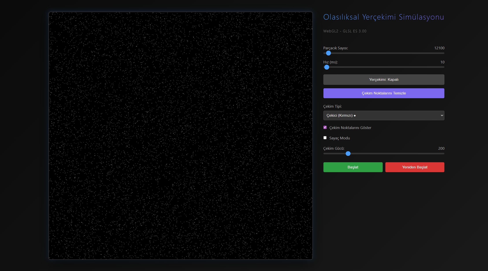
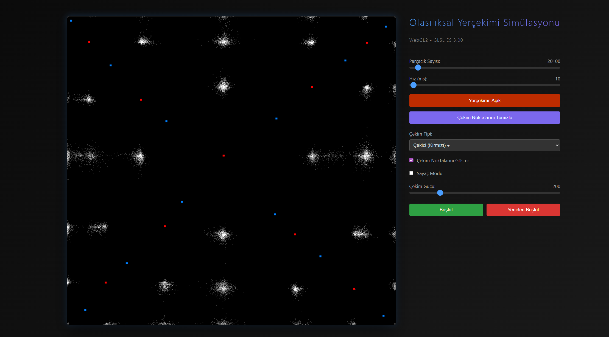

# 🌌 Olasılıksal Yerçekimi Simülasyonu

WebGL2 tabanlı, etkileşimli parçacık simülasyonu. Parçacıklar olasılıksal bir algoritmaya göre hareket eder ve kullanıcı tarafından oluşturulan çekim/itme noktalarına tepki verir.


## 📸 Ekran Görüntüleri


*Çoklu çekim noktaları ile parçacık etkileşimi*


*Yerçekimi simülasyonu - aktif parçacık hareketi*

## ✨ Özellikler

### 🎮 Etkileşimli Kontroller
- **Dinamik Parçacık Sayısı**: 100 ile 500.000 arası ayarlanabilir parçacık sayısı
- **Hız Kontrolü**: Simülasyon hızını 1-1000ms arasında ayarlayabilme
- **Başlat/Duraklat**: Simülasyonu istediğiniz zaman durdurabilme
- **Yeniden Başlatma**: Parçacıkları rastgele konumlara yeniden dağıtma

### 🌀 Yerçekimi Sistemi
- **Çekici Noktalar (Kırmızı ●)**: Parçacıkları kendine çeken yerçekimi merkezleri
- **İtici Noktalar (Mavi ●)**: Parçacıkları iten anti-yerçekimi merkezleri
- **Çoklu Nokta Desteği**: Aynı anda birden fazla çekim/itme noktası oluşturabilme
- **Canlı Sürükleme**: Oluşturulan noktaları fare ile sürükleyerek hareket ettirebilme
- **Sağ Tık Silme**: İstenmeyen noktaları sağ tıklayarak kaldırabilme
- **Ayarlanabilir Güç**: Çekim/itme gücünü 10-1000 arası değiştirme
- **Görünürlük Kontrolü**: Çekim noktalarını gösterme/gizleme

### 📊 Sayaç Modu
- **Bölgesel Sayım**: Fare imleci etrafında belirli bir yarıçaptaki parçacıkları sayma
- **Dinamik Yarıçap**: 20-500px arası ayarlanabilir sayım alanı
- **Görsel Geri Bildirim**: Yeşil çember ile sayım alanını görselleştirme
- **Gerçek Zamanlı Güncelleme**: Parçacık sayısının anlık takibi

### 🎯 Olasılıksal Hareket Algoritması
Parçacıklar, komşu hücrelere geçiş yaparken ağırlıklı rastgele seçim kullanır:
- Yerçekimi kapalıyken: Her yön eşit olasılıkta (1/8)
- Yerçekimi açıkken: Çekim noktalarına yakın yönlere daha yüksek olasılık atanır
- Mesafe bazlı ağırlıklandırma: `ağırlık = (güç × 5.0) / mesafe`
- Birden fazla çekim noktası olduğunda tüm etkiler birleştirilir

## 🚀 Kullanım

### Kurulum
Projeyi klonlayın ve herhangi bir web sunucusu ile çalıştırın:

```bash
git clone https://github.com/kullaniciadi/particle-simulation.git
cd particle-simulation
```

Basit bir HTTP sunucusu başlatın:

```bash
# Python 3 ile
python -m http.server 8000

# Node.js ile (http-server paketi gerekli)
npx http-server

# VS Code Live Server eklentisi ile
# Sağ tık > "Open with Live Server"
```

Tarayıcınızda `http://localhost:8000` adresini açın.

### Temel Kullanım

1. **Simülasyonu Başlatma**
   - "Başlat" butonuna tıklayın
   - Parçacıklar rastgele hareket etmeye başlar

2. **Yerçekimi Noktası Ekleme**
   - "Yerçekimi: Kapalı" butonuna tıklayarak yerçekimini aktifleştirin
   - Çekim tipini seçin (Çekici/İtici)
   - Canvas üzerine tıklayarak nokta ekleyin
   - Eklediğiniz noktayı sürükleyerek konumunu değiştirin

3. **Nokta Silme**
   - Silmek istediğiniz noktaya sağ tıklayın
   - Tüm noktaları temizlemek için "Çekim Noktalarını Temizle" butonunu kullanın

4. **Sayaç Kullanma**
   - "Sayaç Modu" kutucuğunu işaretleyin
   - Fareyi canvas üzerinde hareket ettirin
   - Yeşil çember içindeki parçacık sayısını görün

## 🛠️ Teknik Detaylar

### Teknoloji Yığını
- **WebGL2**: GPU hızlandırmalı grafik rendering
- **GLSL ES 3.00**: Vertex ve fragment shader'lar
- **Vanilla JavaScript**: Framework kullanılmadan saf JS
- **HTML5 Canvas**: Çizim yüzeyi
- **CSS3**: Modern UI tasarımı

### Performans Optimizasyonları
- **GPU Buffer Yönetimi**: `DYNAMIC_DRAW` ile verimli buffer güncellemeleri
- **Bounding Box Kontrolü**: Sayaç modunda gereksiz mesafe hesaplamalarını önleme
- **RequestAnimationFrame**: Tarayıcı refresh rate'ine senkronize animasyon
- **Conditional Rendering**: Sadece gerektiğinde yeniden çizim

### Dosya Yapısı
```
particle-simulation/
├── index.html          # Ana HTML dosyası
├── main.js             # Simülasyon mantığı ve WebGL kodu
├── style.css           # UI stilleri
├── screenshots/        # Ekran görüntüleri
└── README.md          # Bu dosya
```

### WebGL Shader'lar

**Vertex Shader:**
- Parçacık pozisyonlarını piksel koordinatlarından clip space'e dönüştürür
- Nokta boyutunu ayarlar

**Fragment Shader:**
- Parçacıklara renk atar
- Çekim noktaları için farklı renkler (kırmızı/mavi)

## 🎨 Özelleştirme

### Renk Şeması Değiştirme
`style.css` dosyasında gradient renklerini düzenleyin:

```css
h1 {
    background: linear-gradient(90deg, #4a9eff, #7b68ee);
}
```

### Varsayılan Değerleri Ayarlama
`main.js` dosyasında başlangıç değerlerini değiştirin:

```javascript
let particleCount = 100;        // Başlangıç parçacık sayısı
let updateInterval = 10;        // Güncelleme hızı (ms)
let gravityStrengthBase = 200.0; // Çekim gücü
```

### Canvas Boyutunu Değiştirme
`index.html` dosyasında canvas boyutlarını ayarlayın:

```html
<canvas id="glCanvas" width="1000" height="1000"></canvas>
```

## 🧮 Algoritma Açıklaması

### Komşu Hücre Seçimi
Her parçacık için 8 komşu hücre vardır:
```
[-1,-1] [ 0,-1] [+1,-1]
[-1, 0]   [P]   [+1, 0]
[-1,+1] [ 0,+1] [+1,+1]
```

### Ağırlık Hesaplama
1. Başlangıç: Her komşu `ağırlık = 1`
2. Her çekim noktası için:
   - Parçacıktan noktaya yön vektörü hesapla
   - Hedef komşu hücreyi belirle
   - Ağırlığı artır: `ağırlık += (güç × 5.0) / mesafe`
3. Toplam ağırlığa göre rastgele seçim yap

### Sınır Koşulları
Parçacıklar canvas sınırlarında kalır:
```javascript
if (x < 0) x = 0;
if (x >= canvas.width) x = canvas.width - 1;
if (y < 0) y = 0;
if (y >= canvas.height) y = canvas.height - 1;
```

## 📋 Gereksinimler

- **Tarayıcı**: WebGL2 desteği olan modern tarayıcı
  - Chrome 56+
  - Firefox 51+
  - Edge 79+
  - Safari 15+
- **GPU**: WebGL2 uyumlu grafik kartı

## 🐛 Bilinen Sınırlamalar

- Yüksek parçacık sayılarında (>100k) CPU kullanımı artabilir
- Sayaç modu 500k parçacıkta yavaşlayabilir (CPU-bound hesaplama)
- Mobil cihazlarda performans düşük olabilir

## 👤 Yazar

**Mesut Kaval** tarafından yapay zeka yardımıyla oluşturulmuştur.
- GitHub: [@MesutKaval](https://github.com/MesutKaval)

## 🙏 Teşekkürler

- WebGL2 dokümantasyonu için [MDN Web Docs](https://developer.mozilla.org/)
- Shader referansları için [WebGL2 Fundamentals](https://webgl2fundamentals.org/)

---

⭐ Bu projeyi beğendiyseniz yıldız vermeyi unutmayın!
